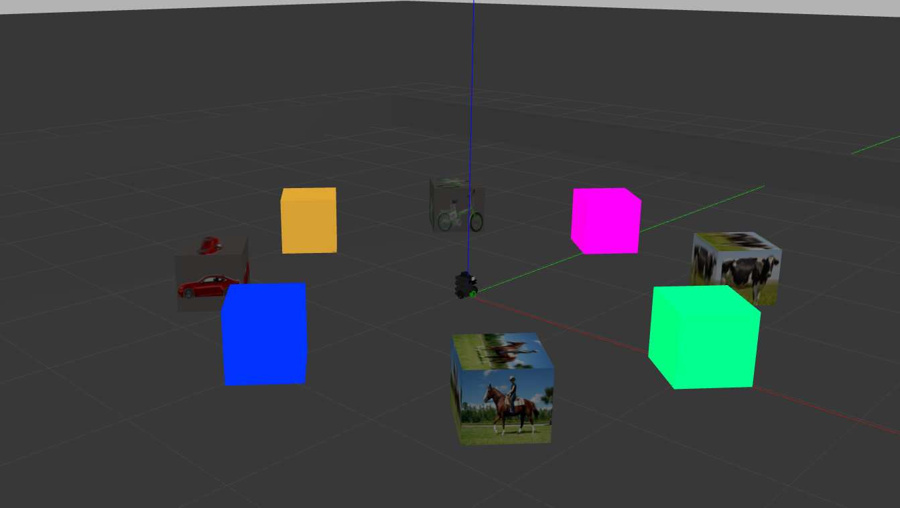
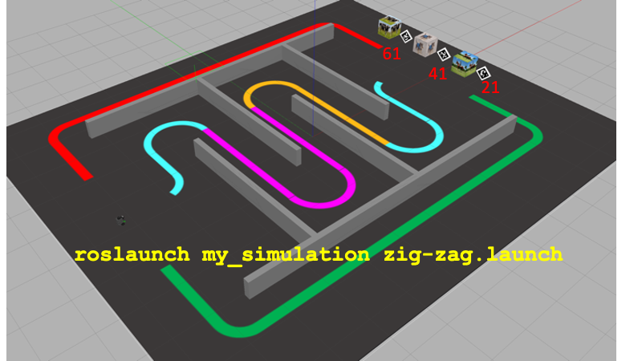

# Robótica Computacional 2022.2

## Simulado 3

**Nesta prova você deverá fazer: 2 questões**

Indique em README.md seu nome e as questões que escolheu fazer. Você deve indicar as questões, senão o avaliador o fará por você.

Nome:_______________

Questões que fez:____________

**Observações de avaliações nesta disciplina:**

* Clone o repositório da prova dentro de `~/catkin_ws/src` se estiver trabalhando no Linux.
* Você poderá dar quantos `git push` quiser no repositório, apenas o último será considerado.
* Antes de finalizar a prova verifique que os arquivos enviados ao github estão na sua última versão. É sua responsabilidade garantir isso.
* Inicie a prova no Blackboard para a ferramenta de Proctoring iniciar.
* Mantenha o Blackboard e o Proctorio abertos todo o tempo da prova
* Só finalize a prova no Blackboard após enviar a prova via Github classroom.
* Durante esta prova vamos registrar somente a tela e o acesso à web, não a câmera nem microfone
* Ponha o nome no enunciado da prova no Github
* Tenha os repositórios https://github.com/Insper/robot22.1/ ,  https://github.com/arnaldojr/my_simulation e https://github.com/arnaldojr/mybot_description.git  atualizados em seu `catkin_ws/src`.
* Você pode consultar a internet ou qualquer material, mas não pode se comunicar com pessoas ou colegas a respeito da prova
* Todos os códigos fornecidos adicionalmente aos scripts em que as questões serão desenvolvidas foram testados em outro contexto, e são apenas um compilado. Não é obrigatório usar. Fique à vontade para modificar esse código e trazer outros arquivos que achar melhor. 
* Teste sempre seu código
* Entregue código que executa - código com erro que impede de executar implica em zero na questào
* Faça commits e pushes frequentes no seu repositório (tem dicas [no final deste arquivo](./instrucoes_setup.md))
* Permite-se consultar qualquer material online ou próprio. Não se pode compartilhar informações com colegas durante a prova.
* Faça commits frequentes. Em caso de disputa sobre plágio, o primeiro a enviar alguma ideia será considerado autor original.
* A responsabilidade por ter o *setup* funcionando é de cada estudante.
* Todo e qualquer arquivo adicional que for usado deve ser incluído no seu repositório. Não serão consideras repostas que necessitem de instalar bibliotecas adicionais que não se encontram no SSD de Robótica, e nem arquivos que se encontram fora do seu repositório.
* É proibido colaborar ou pedir ajuda a colegas ou qualquer pessoa que conheça os assuntos avaliados nesta prova.
* Os exercícios admitem diversas estratégias de resolução. A prova de cada aluno é única. Atenha-se apenas à rubrica de cada questão.

Existe algumas dicas de referência rápida de setup [instrucoes_setup.md](instrucoes_setup.md)

**Integridade Intelectual**

Se você tiver alguma evidência de fraude cometida nesta prova, [use este serviço de e-mail anônimo](https://www.guerrillamail.com/pt/compose)  para informar ao professor através do e-mail `antoniohps1@insper.edu.br`.

# Questões

## Questão 1  (5.0 pontos)

Nesta questão você irá checar qual alvo se aproxima e se a mira laser composta por um círculo e um *crosshair* está acertando esse alvo. A direção do laser é definida pela linha ligando o centro do círculo ao centro do crosshair.

Deve se levar em conta de que o mundo é 3D, e o *crosshair* está à frente do círculo, de forma que a trajetória do laser é uma linha em 3D, com as coordenadas, em pixels, dadas por:

$$ x = z(x_c - x_0)/10 + x_0 $$

$$ y = z(y_c - y_0)/10 + y_0 $$

onde $z$ é a profundidade (distância do observador), $(x_c, y_c)$ são as coordenadas cartesianas do centro do *crosshair*, em pixels, e $(x_0,y_0)$ são as coordenadas cartesianas do centro do círculo, em pixels.

Observe que cada alvo possui uma altura ($H$) diferente, e portanto você deverá checar o tipo de alvo antes.

### O que você deverá fazer

Você precisará definir encontrar a profundidade do alvo com base na sua altura encontrada na imagem e a altura no mundo real. A altura real do avião é de $H=3,5m$, a da bibcleta é $1m$ e do carro é $1,8m$. A imagem `aeroplane.png` é um exemplo de fotografia tirada quando o avião estava a $D=12,65m$ de profundidade. **Corrija eventuais erros da Mobilenet com base na cor da imagem do alvo**.

Uma vez conhecida a profundidade, as equações acima devem ser usadas para descobrir as coordenadas $(x,y)$ de impacto do tiro para aquela profundidade. Finalmente basta verificar se essas coordendas se encontram dentro da imagem do alvo. 

Caso o laser acerte o alvo, escreva "ACERTOU X" na tela, onde X deve ser substituído pelo nome do alvo. 

#### Orientações

Trabalhe no arquivo `./q1/q1.py`. Este exercício **não precisa** de ROS. Portanto pode ser feito até em Mac ou Windows. Antes de tudo rode o arquivo para checar se o video é mostrado. 

#### O que você deve fazer:

|Resultado| Conceito| 
|---|---|
| Não executa | zero |
| Determina a distância focal da câmera virtual, com saída de informação no terminal ou na tela | **+0.63**|
| Determina o retângulo envolvente do alvo na imagem| **+0.63**|
| Identifica corretamente o tipo de alvo  e escreve na tela | **+0.63**|
| Identifica a profundidade do alvo e escreve na tela | **+0.9**|
| Identifica corretamente o centro da circunferência da mira, com saída visual |**+0.63**|
| Identifica corretamente o centro do *crosshair*, com saída visual   |**+0.9**|
| Identifica corretamente o ponto na imagem de possível colisão, com saída visual   |**+0.63**|
| Detecta corretamente se o laser acerta o alvo, com mensagem na tela, mantendo todas as outras saídas visuais pedidas nas rubricas anteriores | 5.0 |

Casos intermediários ou omissos da rubrica serão decididos pelo professor.

## Questão 2  (2.50 pontos)

Você deve fazer um programa que detecta o vencedor do jogo pedra, papel e tesooura. 

Trata-se de um disputa entre 2 jogadores.

* Jogador1 = mão posicionada a esquerda do video
* Jogador2 = mão posicionada a direita do video

A cada rodada os jogadores escolhem sua jogada entre as opções:

- Pedra
- Papel 
- Tesoura

O resultado de cada rodada pode ser `empate` ou `vencedor` onde:

* Empate: Acontece quando os dois jogadores escolhem a mesma opção de jogada
* Vencedor: Acontece com as seguintes combinações de jogadas:
    - Pedra vence de Tesoura
    - Papel vence de Pedra
    - Tesoura vence de Papel 

### Orientações

Você vai trabalhar no arquivo `q2/q2.py`. com o vídeo `pedra-papel-tesoura.mp4` que já estão no diretório.

### O que você deve fazer:

Fazer o programa que devolve um output visual de acordo com a rubrica. 

### Rubrica

O que é esperado para cada rubrica:

|Resultado| Conceito| 
|----------|--------|
|Não executa | 0 |
|Identifica ao menos um jogador e produz saída visual demonstrando | 1.0 |
|Identifica corretamente os dois jogadores e produz saídas visuais diferentes demonstrando | 1.8 |
|Identifica ao menos uma jogada dos jogadores e identifica escrevendo no output visual (ex: “JOGADOR `x` = `<PEDRA, PAPEL, TESOURA>`”). | 3 |
|Identifica corretamente todas as jogadas dos jogadores e identifica escrevendo no output visual | 4 |
|Compara as jogadas e informa se foi empate ou que jogador que venceu | 5 |

Casos intermediários ou omissos da rubrica serão decididos pelo professor.

## Questões de ROS

**Atenção: ** 

Para fazer estas questões você precisa ter o `my_simulation` e o `mybot_description` atualizado.

    cd ~/catkin_ws/src
    cd my_simulation
    git stash
    git pull

Ou então se ainda não tiver:

    cd ~/catkin_ws/src
    git clone https://github.com/arnaldojr/my_simulation.git

Para o mybot_description:

    cd ~/catkin_ws/src
    cd mybot_description
    git stash
    git pull

Ou então se ainda não tiver:

    cd ~/catkin_ws/src
    git clone https://github.com/arnaldojr/mybot_description

Em seguida faça o [catkin_make](./instrucoes_setup.md). 

## Questão 3 (5.0 pontos)

Você deverá fazer o robô gerar aleatoriamente dois números entre 1 e 4 ($n1$ e $n2$). Então ele deverá ir até o cubo com a figura indicada por $n1$, parar a $30 cm$ do mesmo, levantar e abaixar a garra, e depois avançar até o cubo da cor indicada por $n2$, parando a $30 cm$ do mesmo e levantando a garra.

Para iniciar o cenário do Gazebo, *atualize* o repositório `my_simulation` e execute:

    roslaunch my_simulation encaixotado.launch
    roslaunch mybot_description mybot_control2.launch 

#### O que é para fazer

Faça o robô visitar primeiro um cubo com um afigura, e depois um cubo de cor sólida com base em $n1$ e $n2$ respectivamente, ambos inteiros sorteados aleatoriamente entre 1 e 4. A figura e a cor correspondem aos números da tabela abaixo:

|Número | Figura | Cor 
|---|---|---|
| **1** | Vaca | Amarelo |
| **2** | Cavalo | Verde |
| **3** | Carro  | Azul  |
| **4** | Bicicleta  | Magenta |

Para responder à questão você deverá trabalhar em `sim3_222/scripts/q2.py`.

|Resultado| Conceito| 
|---|---|
| Não executa | 0 |
| Identifica os objetos da imagem **ou** segmenta a cor desejada | 1.0 |
| Identifica os objetos da imagem **e** segmenta a cor desejada | 2.0 |
| Consegue ir até o primeiro cubo  | 3.2 |
| O robô consegue ir até os dois cubos, mas não para nem levanta a garra| 4.2 |
| Faz tudo o que se pede | 5.0|

Casos intermediários ou omissos da rubrica serão decididos pelo professor.

Seu robô está no cenário visível abaixo:

</img>

Que pode ser disparado com o comando: 

    roslaunch my_simulation zig-zag.launch

## Questão 4  (5.0)

Sabe-se que se um robô seguir uma parede em um labirinto virando sempre para o mesmo lado  quando encontra um obstáculo (direita ou esquerda) eventualmente vai acabar saindo do labirinto. 

Seu robô precisa percorrer os corredores e encontrar um animal de interesse lá no final. Depois deve retornar. 

#### O que é para fazer

**Inicialmente** você deve sortear um número inteiro entre 0 ou 1, correspondendo respectivamente a *cachorro* e *cavalo*.

**Passo 1** o robô vai precisar seguir os corredores definidos pela parede e pela pista ciano-magenta-laranja-ciano. Para fazer isso pode usar qualquer método (seguir as pistas, ou virar sempre para a esquerda quando encontrar obstáculo). O importante é sair do outro lado

**Passo 2** o robô vai precisar encontrar o seu animal sorteado, parar na frente dele por 5 segundos e dar uma mensagem bem clara de "encontrei o animal". O animal precisa ter na tela uma área maior que 1000 pixels neste momento

**Passo 3** O robô deve então escolher seguir de volta a pista vermelha ou verde para retorna à posição inicial 

#### Detalhes de como rodar

O código para este exercício está em: `sim3_222/scripts/q3.py`

|Resultado| Conceito| 
|---|---|
| Não executa | 0 |
| Entra no labirinto e consegue realizar pelo menos 2 curvas corretas | 0.75 | 
| Chega ao final do labirinto | 2.0 | 
| Localiza o animal e vai em direção a ele | 3.0 | 
| Dá a mensagem e para em frente ao animal pelo tempo certo | 4.0 | 
| Segue a pista vermelha ou verde pelas bordas e volta ao início | 5.0 |

Casos intermediários ou omissos da rubrica serão decididos pelo professor.

**Boa sorte!!**